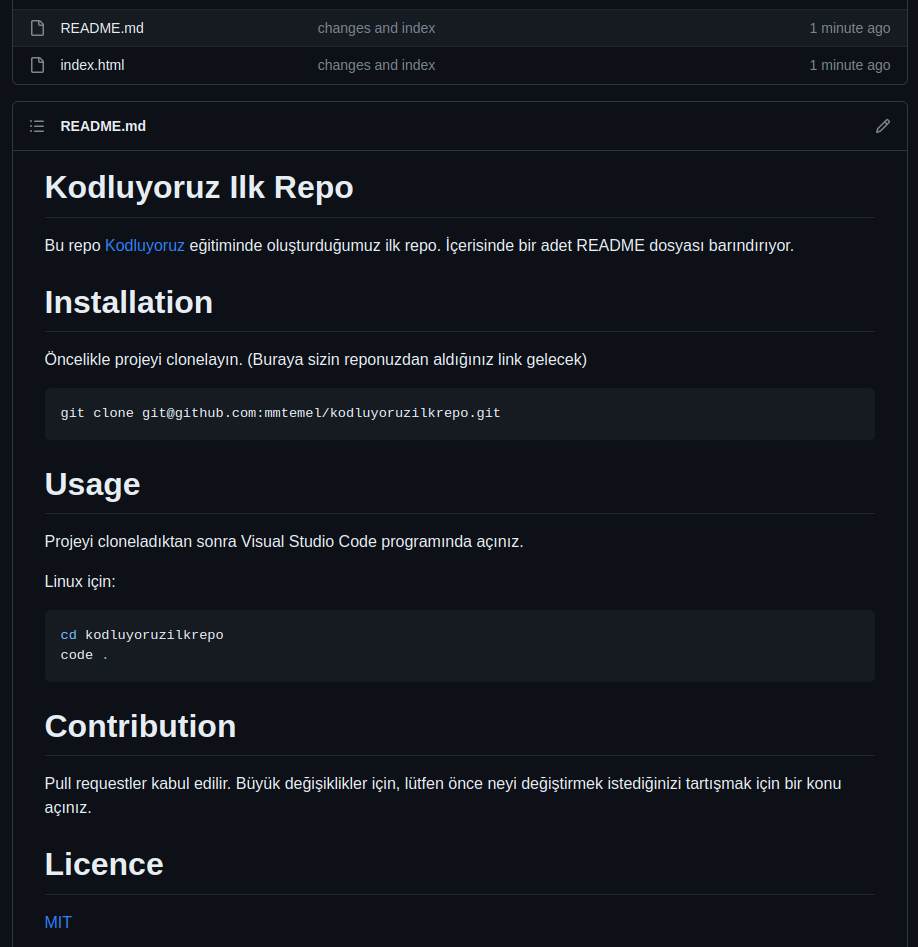

# Kodluyoruz Ilk Repo

Bu repo [Kodluyoruz](https://kodluyoruz.org/) eğitiminde oluşturduğumuz ilk repo. İçerisinde bir adet README dosyası barındırıyor.



# Installation

Öncelikle projeyi clonelayın. (Buraya sizin reponuzdan aldığınız link gelecek)

```bash
git clone git@github.com:mmtemel/kodluyoruzilkrepo.git
```

# Usage

Projeyi cloneladıktan sonra Visual Studio Code programında açınız.

Linux için:

```bash
cd kodluyoruzilkrepo
code .
```

# Contribution

Pull requestler kabul edilir. Büyük değişiklikler için, lütfen önce neyi değiştirmek istediğinizi tartışmak için bir konu açınız.

# Licence

[MIT](https://choosealicense.com/licenses/mit/)